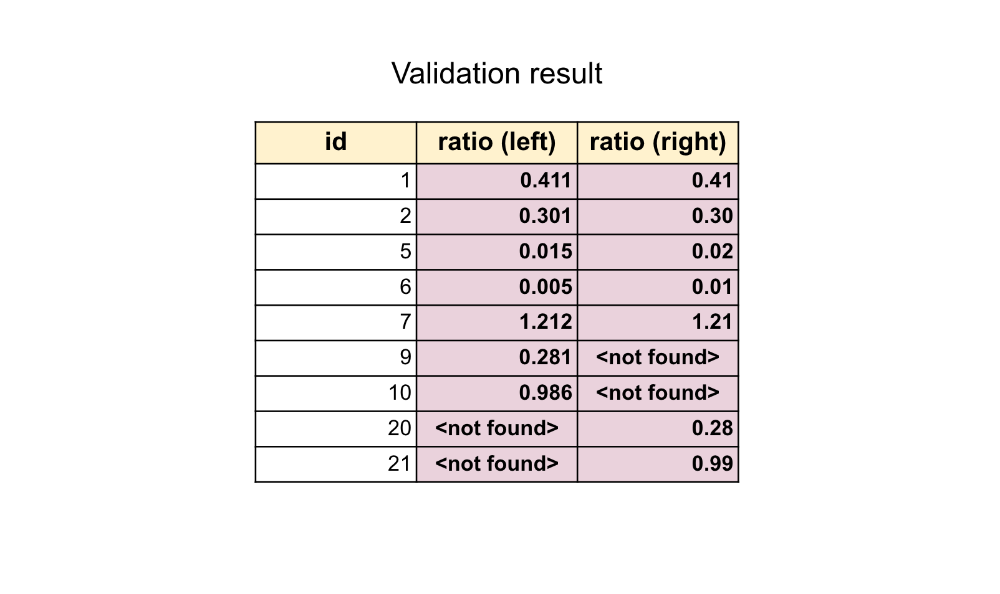

# Data validation tool

Data validation tool (DVT) is a standalone application for columnar data comparison between two data sources. 

#### 1. Idea
 
The idea is to compare columnar data that represented as key-value data.

For example, we have "DEPARTMENTS" table, and we want to compare data between the current version of our application and a new one.
We have to bring up two separate versions of our application and check the data:
 
  
 
Here we can see the differences in "ID" column and "RATIO" column. In order to be able to find the discrepancies
we have to compare the data using some unique key ("ID" in our case). 
So, the comparison has to be done in a next way:

 

and the comparison result will look like:

Using this approach we've found rows that contains changed data. Now we can review
the discrepancies and will see that:
 
    "RATIO" column precision has changed.
 
The second inconsistency is:
    
    - ids: [9, 10] haven't been found in second datasource;
    - ids: [20, 21] haven't been found in first datasource. 

---

The false-positive scenario can happen when we apply some data schema changes.
For example, in the first version we have two columns "FIRST_NAME" and "LAST_NAME". In a new version of our software 
we decided to define a new column "NAME" that will contain both the first and the last name. We've also removed "FIRST_NAME" and "LAST_NAME" columns. 

In this case the validation check will fail, and we'll track and control these changes. To be sure, the changes applied successfully, 
we can apply some transformation function to the first data source and compare the results with second one:

---

The problem is that tracking the data changes is extremely hard, especially when you have a lot of columns and millions of rows in your tables. 
Is it completely impossible to track it manually with your eyes everytime you deploy a new version of your software.

The idea is to create an application that will be able to:
 1. load data from different data source types (web-services, SQL or No-SQL databases, it is also possible to use an application UI for 
 fetching data, if there is no way to load it from back-end in some automatic mode, etc). Any datasource which supports key-value data representation 
 can be connected to DVT;
 2. index fetched data and cache it for future usage;
 3. perform data validation using some predefined or custom user-defined transformers and provide validation results with data discrepancies.

#### 2. Solution

#### 3. Basic Architecture

#### 4. Supported datasources

#### 5. First Steps

#### 6. Configurationpic_5
