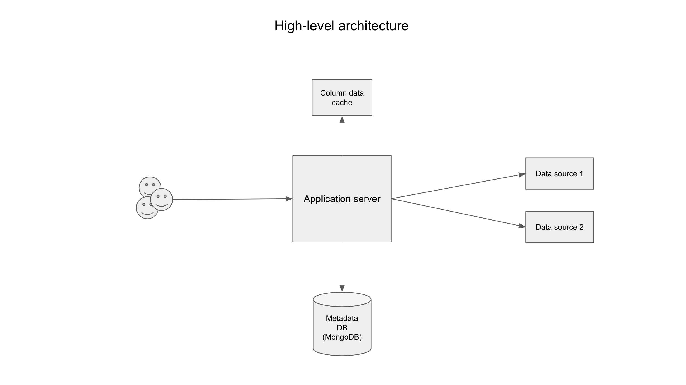
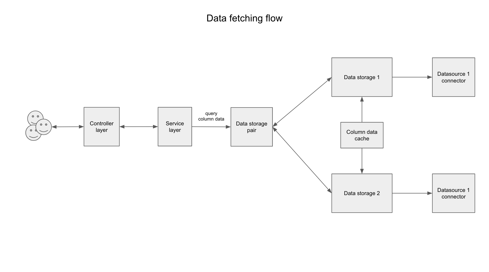
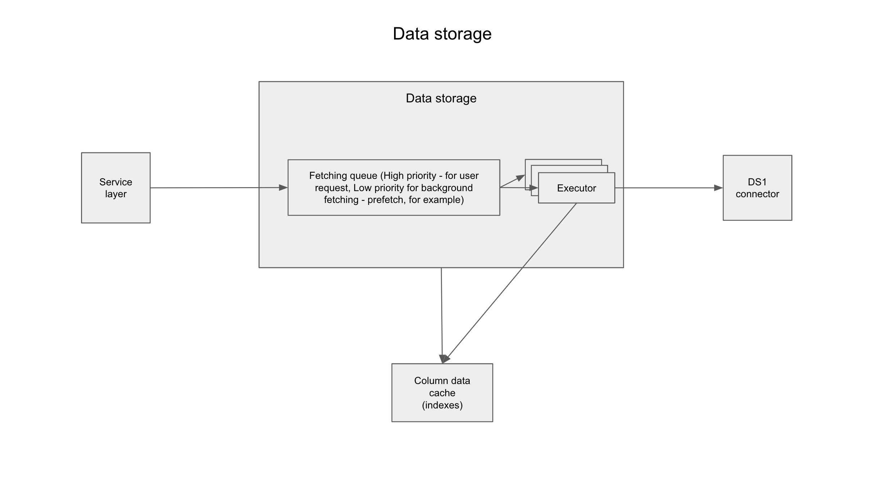
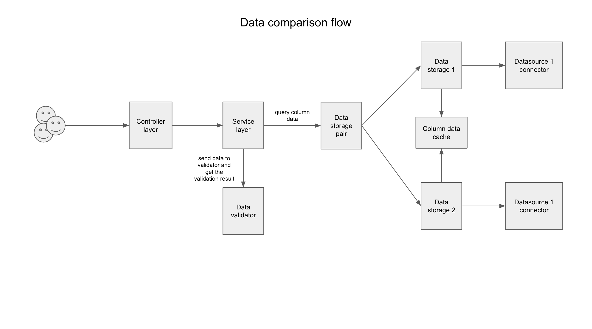

# Basic architecture

## High-level architecture 

Application consists of the next basic components:
- Application server (Spring boot JAVA application);
- Metadata database (MongoDB) - database for storing application data;
- Column data cache component - storage for caching indexed data loaded from data sources (column data). Now we store data in memory;
- Data sources - various data sources, supported by application.  

## Data fetching flow

When user requests validation of a specific column:
 - Application queries both data sources simultaneously (if there is no data in cache);
 - After loading data from a source, application indexes loaded data and caches it;
 - Validation, transformation and data binding perform their operations using these indexes.

## Data storage

Data storage is the main abstraction on a data source. The responsibility of this component is data fetching according to the next rules:
- Every data source has it's own parallelism factor - how many simultaneous threads can load data from this source;
- Data storage has it's own priority process queue that represent column fetching requests. There can be two types of fetching requests: user requests and background 
(for example, caching) requests. User requests have higher priority than background requests (For more details, 
see: [Data fetching and pre-caching](/docs/features_data_fetching_and_caching.md));
- Every storage has it's own thread that is equal data source parallelism factor;
- After fetching the data from source executor will index this data and put it into cache storage.

## Data comparison flow

- Data comparison flow use data storage for fetching pair of column data from both storages;
- Data validator gets both indexes (column data's) and performs comparison applying defined transformers to every data row;
- Data validator produces validation result which is nothing more than an abstraction represents failed ids - ids of entities which data is differ.
- When data returns to the user - validation response builds using provided data binder that forms human-readable result.

